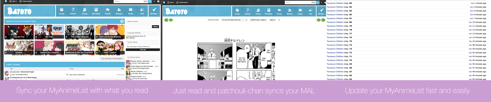

# patchouli-chan

### mal scrobbler/autosync for manga


Get it on the [Chrome Web Store!](https://chrome.google.com/webstore/detail/patchouli-chan-auto-sync/dinnbkcfnmmhapafnjcknpncdonhmmlf)

## Table of Contents
* [Introduction](#introduction)
* [Installation](#installation)
* [Adding Support/Contributing](#adding-supportcontributing)

# Introduction

A browser extension that scrobbles what you're reading with MyAnimeList

#### Currently Supported Sites:
* Batoto
* KissManga

There came the need for an extension to update MAL because the one I have for anime, [MAL Updater OS X](https://github.com/myh1000/malupdaterosx-cocoa), uses Chrome's applescript to get a list of tabs (not necessarily the active one) and take the first one that it came upon that matched its search parameter's (eg. KissAnime or Crunchyroll).

While it may be normal to have only one anime tab open, I typically have tens of manga tabs open -- thus came the need for a solution to the active tab problem: **mal-autosync-manga**.

Original source code and inspiration from [mal-scrobble](https://github.com/TSedlar/mal-scrobble).



# Installation
The extension itself is within the ```build/chrome/``` folder.

1. Download the zip file or clone the git repository
2. Unpack and save **```build/chrome/```** to a secure location
2. Go to the extension list: chrome://extensions
3. Activate "Developers Mode"
4. Click "Load unpacked extension…"
5. Select the folder with the extension and enjoy


## Building from source

```shell
git clone https://github.com/myh1000/mal-autosync-manga.git
cd mal-autosync-manga
npm install
npm run build
```

# Adding Support/Contributing

Please look under ```src/app/handlers``` for examples as guidance for how to add support for your favorite manga reader.

 Edit ```accept``` and ```parseData``` so the extension runs and syncs only on the manga chapter pages.
